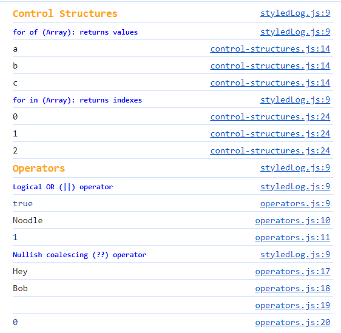

<p align="center">  </p>

# JavaScript Examples and Playground

Single page application (SPA) JavaScript playground. It allows you to write
JavaScript code snippets and easily view the output in the console or browser,
using vite.js for running a local server.

This can be used as a quick reference for JavaScript code snippets, or as a
playground to test out new code.

## Features

- **Write and Test Code**: Edit the `app.js` file to see your JavaScript code snippets in action.
- **Instant Feedback**: View the console output in real-time without having to refresh the page.

## Installation

```bash
npm install
```

## Usage

```bash
npm start
```

## Usage

Once the application is running, open a browser and navigate to `http://localhost:5173/`.

When the server is running, all changes made will be automatically reloaded in the browser.

### Viewing the examples output

The examples are just a series of files that are imported into the `app.js`
file. These files contain code snippets that log out to the console. To view the
output for the examples, open the console in your browser. Once open, you can
view the relevant snippet by clicking on the file name in the console, or
opening the file located in the `src/js` directory.

You can comment out the examples you don't want to see in the console by
commenting out the import statement in the `app.js` file. 



**Note**: You can ignore any the `styledLog` functions as they are only
used to help format the output in the console.

## To Do's

- add jest for testing and set up a testing environment